# DIET-IA — Asistente de recetas y planificación alimentaria

**Autores:**
- Francisco José Salmerón Puig
- Ismael Torres González

Última actualización: 2026-05-25

Resumen
-------
DIET-IA es un proyecto desarrollado por el IES Zaidín Vergeles que provee un asistente para recomendar y adaptar recetas usando técnicas de IA (embeddings semánticos, NER y LLMs) y herramientas de Big Data. Permite buscar recetas por ingredientes, aplicar filtros por alergias/dietas y ajustar recetas a objetivos nutricionales.

Tabla de contenidos
-------------------

- Visión general
- Quickstart (Docker / Local)
- Arquitectura y diagrama
- Servicios y endpoints (API)
- Datos y modelos
- Entrenamiento e indexado
- Variables de entorno y Docker
- Desarrollo local y orden de arranque
- Esquema de la base de datos (MongoDB)
- Testing y CI
- Seguridad y buenas prácticas
- Troubleshooting
- Contribuir
- Licencia y contacto

Visión general
--------------
DIET-IA combina:

- Un motor de similitud semántica de recetas (`Backend/ai/recipe_ai.py`) basado en `sentence-transformers`.
- Un backend AI (FastAPI) que expone `/api/ai/*` y realiza indexado, búsqueda y enriquecimiento de recetas (`Backend/ai/main.py`).
- Un backend Node/Express para autenticación y gestión de recetas (`Backend/src`).
- Una app Expo/React Native que consume las APIs (`Frontend-APP/Diet-ia-pruebas`).

Quickstart — Docker (recomendado)
--------------------------------

Requisitos previos: Docker Desktop (Windows), Docker Compose v2.

Levantar el stack completo:

```powershell
docker compose up --build -d
docker compose logs backend --tail 200
```

Comprobar healthcheck (vía proxy):

```bash
curl http://localhost/api/ai/health
```

Quickstart — ejecutar IA local sin Docker
----------------------------------------

```powershell
cd Backend/ai
python -m venv .venv
.\.venv\Scripts\activate
pip install -r requirements.txt
uvicorn main:app --reload --host 0.0.0.0 --port 8000
```

Frontend (Expo)
---------------

```bash
cd Frontend-APP/Diet-ia-pruebas
npm install
npx expo start
```

Arquitectura y diagrama
-----------------------

Componentes principales:

- `Backend/ai` — FastAPI: recomendaciones, indexado, healthcheck.
- `Backend/src` — Node/Express: auth, recetas, proxy a AI.
- `Frontend-APP/Diet-ia-pruebas` — Expo app.
- `models/` y `datasets/` — artefactos y datos.
- Servicios opcionales: `Kafka`, `HBase`, `Spark`.

```mermaid
flowchart LR
  A[Frontend (Expo)] -->|HTTP| B[Backend Node (Express)]
  B -->|API| C[Backend IA (FastAPI)]
  C --> D[Embeddings / Models]
  B --> E[MongoDB]
  C --> F[Kafka (opcional)]
  F --> G[Consumer / Analytics]
```

Servicios y endpoints (API)
--------------------------

AI (FastAPI) — base URL: `http://<host>:8000/api/ai` (en Docker via Nginx: `/api/ai`)

1) `POST /api/ai/recommend`
- Descripción: devuelve recetas relevantes para una lista de ingredientes y filtros.
- Request JSON ejemplo:

```json
{
  "ingredients": ["tomate", "ajo", "aceite de oliva"],
  "user_id": "guest",
  "filters": {"exclude_allergens": ["lactosa"], "diet": "vegetarian", "max_calories": 600},
  "top_k": 5
}
```

- Response JSON (fragmento):

```json
{
  "results": [ { "recipe_id": "12345", "title": "Ensalada...", "SimilarityScore": 0.87 } ]
}
```

2) `GET /api/ai/health` — Healthcheck: `{ "status": "ok" }`.

Node backend (Express) — base URL: `http://<host>:3000` (en Docker proxy via `/`)

- `GET /api/recipes` — listado paginado (`?page=&limit=&tag=&diet=`).
- `POST /auth/register`, `POST /auth/login` — autenticación.
- Nota: `Backend/src/routes/ai.js` contiene un puente (proxy) que puede reenviar a `http://localhost:8000/recommend` — mantener sincronizado con el prefijo FastAPI.

Servicios desplegados (docker-compose)
-------------------------------------

A continuación se describe para qué se utiliza cada servicio definido en `docker-compose.yaml`:

- `mongo`: Base de datos MongoDB. Almacena colecciones principales como `recipes`, `users` y `ratings`.
- `zookeeper`: Servicio de coordinación requerido por Kafka y HBase (gestiona quorum y metadatos).
- `hbase`: Almacenamiento distribuido opcional para datos en grandes volúmenes y tablas NoSQL (se usa en pipelines y análisis cuando está habilitado).
- `kafka`: Bus de mensajería para eventos y pipelines.
- `spark-master` y `spark-worker`: Cluster Apache Spark para procesamiento por lotes, ETL y jobs de generación de features/embeddings y análisis a gran escala.
- `backend` (FastAPI): Servicio AI principal (Python). Indexa embeddings, realiza búsquedas semánticas y expone los endpoints `api/ai/*` (recomendación, healthcheck, indexado).
- `backend-node` (Node/Express): API pública y backend de negocio. Gestiona autenticación, CRUD de recetas, frontend proxy y reenvía llamadas a `backend` cuando procede.
- `nginx`: Reverse proxy y punto de entrada HTTP público. Encamina peticiones al `backend-node` y al `backend` (a través de rutas/proxy) y expone los puertos al host.

Esta configuración permite separar responsabilidades: `backend` gestiona la lógica y modelos de IA, `backend-node` gestiona la API pública y autenticación, mientras que `mongo`, `kafka`, `hbase` y `spark` proporcionan almacenamiento y capacidades de procesamiento/streaming para pipelines y análisis.

Datos y modelos
---------------

- Datasets: `Backend/datasets/RAW_recipes.csv`, `train.json`, `val.json`, `test.json`.
- Artefactos del embedder: `models/embedder/` (tokenizers, safetensors). Si faltan, se usa `sentence-transformers/all-MiniLM-L6-v2` por defecto.
- Modelos NER: `models/ner/`.

Entrenamiento e indexado
------------------------

Flujo recomendado:

1. Preprocesado y normalización (`python/generatetraindata.py`).
2. Entrenamiento NER (`python/ner_Salmeron.py`).
3. Entrenamiento/ajuste del recomendador (`python/train_recommender.py`).
4. Generar embeddings con `sentence-transformers` y guardar en `models/embedder/`.
5. Indexado: almacenar embeddings en la colección `recipes` o en una vector DB (Faiss/Milvus) para producción.

Comandos de ejemplo:

```powershell
cd python
python generatetraindata.py
python train_recommender.py
python ner_Salmeron.py
```

Variables de entorno y Docker (detalladas)
----------------------------------------

Variables principales que usa el stack (ejemplos):

- `MONGO_URI` — Cadena de conexión a MongoDB. Ejemplo: `mongodb://mongo:27017/diet-ia`.
- `MONGO_DB` — Nombre de la base de datos por defecto (p. ej. `diet-ia`).
- `AI_MODEL_PATH` — Ruta local a los artefactos del modelo embedder (opcional). Si no existe, se descargará un modelo por defecto.
- `OPENAI_API_KEY` — Clave para usar OpenAI en flujos de adaptación/LLM (opcional).
- `KAFKA_BOOTSTRAP_SERVERS` — Dirección(es) de Kafka (ej. `kafka:9092`) para producers/consumers.
- `HBASE_HOST`, `HBASE_PORT` — Configuración de HBase si está habilitado (opcional).
- `SPARK_MASTER` — URL del master de Spark (ej. `spark://spark-master:7077`).
- `NODE_ENV`, `PORT` — Variables usadas por `backend-node` (Node/Express).
- `LOG_LEVEL` — Nivel de logging (`DEBUG`, `INFO`, `WARN`, `ERROR`).

Consejos de uso con `docker-compose`:

- Para levantar todo el stack en segundo plano:

```powershell
docker compose up --build -d
```

- Ver logs de un servicio (ejemplo `backend`):

```powershell
docker compose logs -f backend
```

- Parar y eliminar contenedores y volúmenes definidos:

```powershell
docker compose down --volumes --remove-orphans
```

- Si quieres una ejecución ligera para desarrollo, puedes comentar en `docker-compose.yaml` los servicios `hbase`, `kafka` y `spark-*` y levantar solo `mongo backend backend-node nginx`.

Ejecutar en local (sin Docker)
-----------------------------

Backend AI (FastAPI):

```powershell
cd Backend/ai
python -m venv .venv
.\.venv\Scripts\activate
pip install -r requirements.txt
uvicorn main:app --reload --host 0.0.0.0 --port 8000
```

Backend Node (API pública):

```powershell
cd Backend
npm install
npm start
```

Endpoints rápidos y ejemplos
---------------------------

AI (FastAPI) — base: `http://localhost:8000/api/ai` (o proxied vía Nginx `/api/ai`):

- `POST /api/ai/recommend` — Recomendaciones. Ejemplo:

```bash
curl -X POST http://localhost/api/ai/recommend \
  -H "Content-Type: application/json" \
  -d '{"ingredients":["tomate","ajo"],"top_k":5}'
```

- `GET /api/ai/health` — Healthcheck: devuelve `{ "status": "ok" }`.

Node backend (Express) — base: `http://localhost:3000` (o proxied vía `/`):

- `GET /api/recipes` — Listado de recetas (paginado).
- `POST /auth/register`, `POST /auth/login` — Auth.

Comandos útiles de mantenimiento
-------------------------------

- Reconstruir imágenes después de cambios en `Backend`:

```powershell
docker compose build backend backend-node
docker compose up -d
```

- Ejecutar tests unitarios Python (Backend/ai):

```powershell
cd Backend/ai
pytest -q
```

Notas sobre persistencia
------------------------

Los volúmenes declarados en `docker-compose.yaml` (`mongo_data`, `kafka_data`) persisten datos entre reinicios. Para borrar datos de desarrollo, ejecutar `docker compose down --volumes`.

Si necesitas que documente variables de entorno específicas por servicio (por ejemplo `backend` vs `backend-node`) o añada ejemplos de `.env` y plantillas de `docker-compose.override.yml`, dímelo y los añado.

Desarrollo local — orden sugerido de arranque
-------------------------------------------

1. `mongo`
2. `kafka`, `hbase`, `spark` (si son necesarios)
3. `backend` (FastAPI)
4. `backend-node` (Node/Express)
5. `frontend` (Expo)

Esquema de la base de datos (MongoDB)
------------------------------------

- `recipes`:
  - `_id`, `title`, `ingredients` (array), `steps`, `tags`, `nutrition` (object), `embeddings` (vector opcional), `source`.
- `users`:
  - `_id`, `email`, `password_hash`, `preferences` (diet, allergens), `history`.
- `ratings`:
  - `user_id`, `recipe_id`, `rating`, `notes`, `timestamp`.

Testing y CI
------------

- Tests unitarios Python: `pytest` (ejecutar en `Backend/ai`).
- Tests de integración: levantar servicios mínimos en CI (`mongo`, `backend`) y ejecutar peticiones a endpoints.
- Sugerencia: plantilla GitHub Actions que haga `docker compose up -d mongo backend` y ejecute `pytest`.

Buenas prácticas y seguridad
---------------------------

- No subir claves ni modelos pesados al repositorio (usar `.gitignore` y un storage/registry para artefactos).
- Guardar secretos en variables de entorno o secret managers.
- En producción, habilitar TLS y restringir el acceso a servicios internos.

Troubleshooting (FAQ)
---------------------

- 502 desde Nginx: comprobar que `backend` (FastAPI) está escuchando en el puerto 8000.
- Proxy Node→AI desincronizado: revisar `Backend/src/routes/ai.js` y `Backend/ai/main.py` para asegurar prefijos y rutas.
- AI no carga modelos: comprobar `models/embedder/` y la variable `AI_MODEL_PATH`.

Contribuir
----------

1. Crea una rama `feature/` o `fix/`.
2. Añade tests para cambios funcionales.
3. Ejecuta linters y `pytest` antes de abrir PR.

Archivos relevantes
------------------

- `Backend/ai/main.py` — FastAPI entrypoint.
- `Backend/ai/recipe_ai.py` — motor de similitud.
- `Backend/src/server.js` — Node server.
- `Backend/src/routes/ai.js` — proxy Node → AI.
- `Frontend-APP/Diet-ia-pruebas/services/api.js` — construcción de `API_URL`.
- `docker-compose.yaml`, `nginx.conf` — orquestación y proxy.
- Guías adicionales: [COPILOT.md](COPILOT.md), [Instrucciones.md](Instrucciones.md), [README_DETAILED.md](README_DETAILED.md)

Imágenes y capturas
--------------------

Capturas y gráficos relevantes del proyecto (si no aparecen, comprueba que los archivos existen en las rutas indicadas):

- NER heatmap: 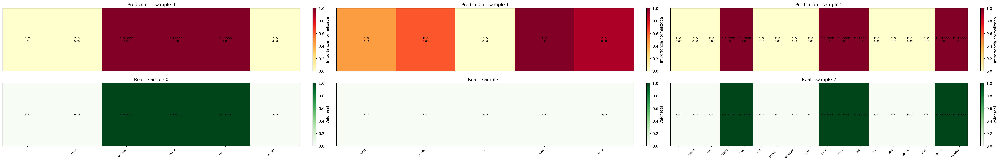
- NER model metrics: 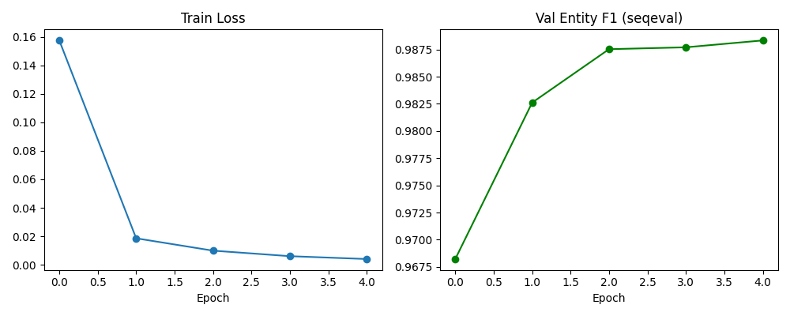
- Training history: 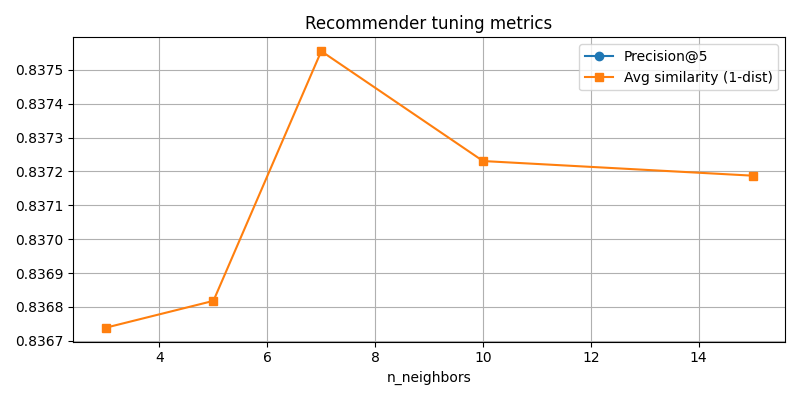
- App logo (frontend): 
- MongoDB — users collection (MongoDB Compass): 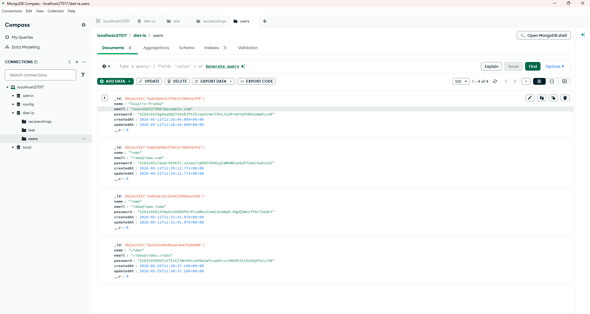
- MongoDB — recipes collection (`test`): 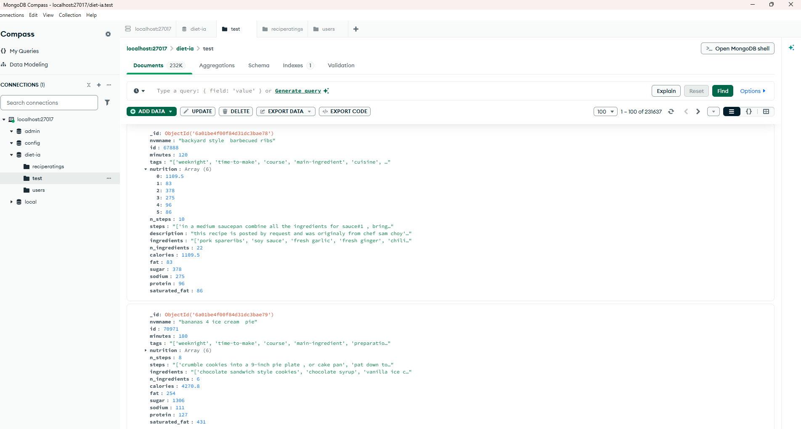
-- MongoDB — recipe ratings collection: 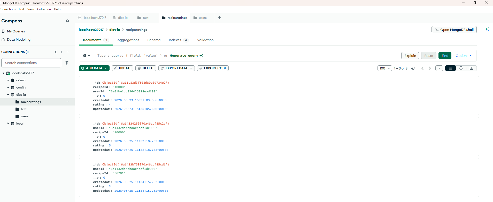

- Spark Master Web UI: 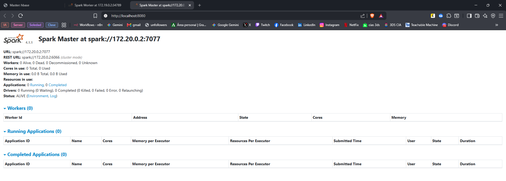
- Spark Worker Web UI: 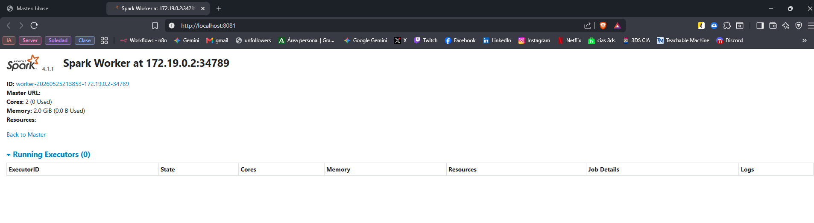
- HBase Web UI: 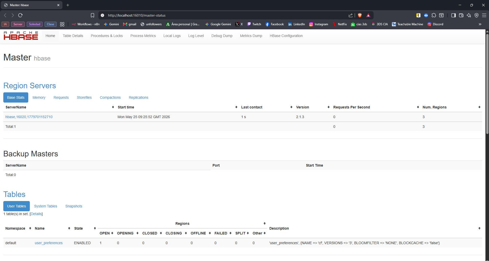
- Backend running / health (screenshot): 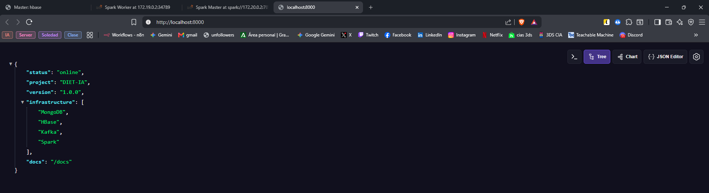
- Web — Home (captura): 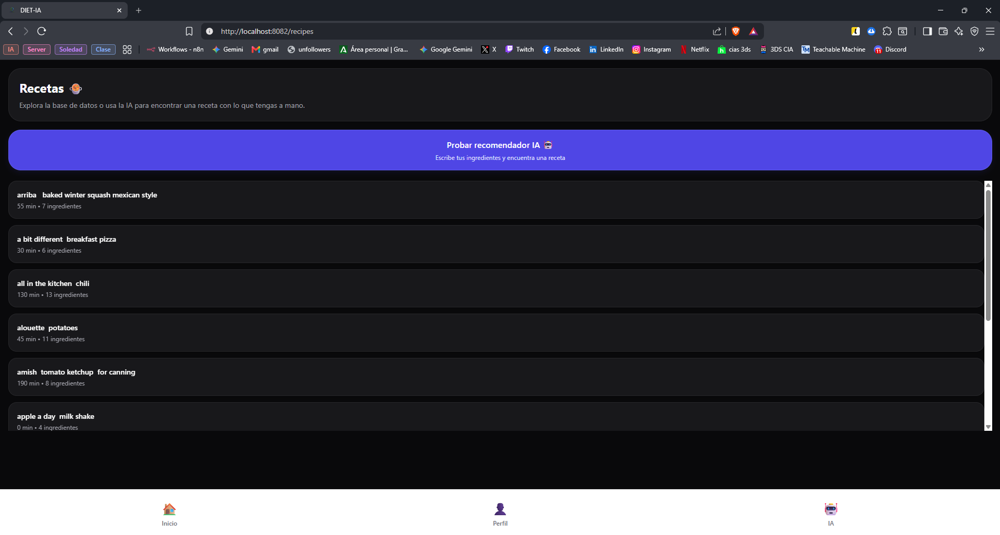
- Web — Vista receta: 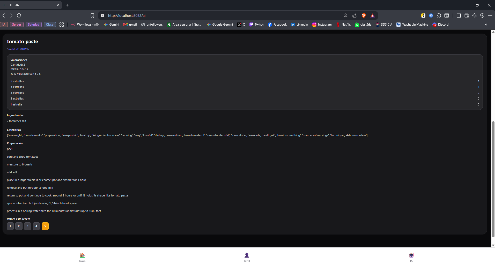
- Web — AI (captura): 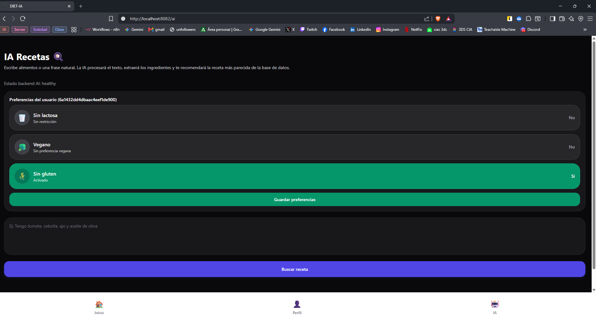
- Web — Perfil de usuario: 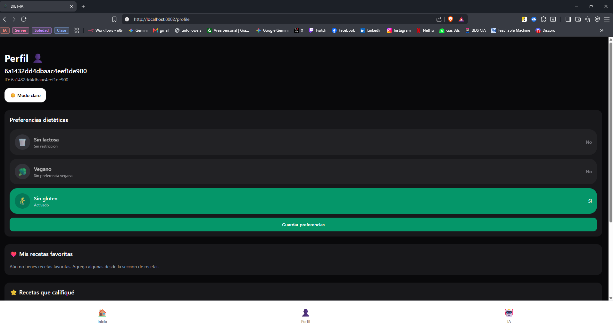

Licencia
--------

Consulta el archivo `LICENSE` en la raíz del repositorio para los términos de uso.

Contacto
-------

Autores: Francisco José Salmerón Puig, Ismael Torres González

Vídeo demo: https://youtu.be/o1ZhQoigmYA

---