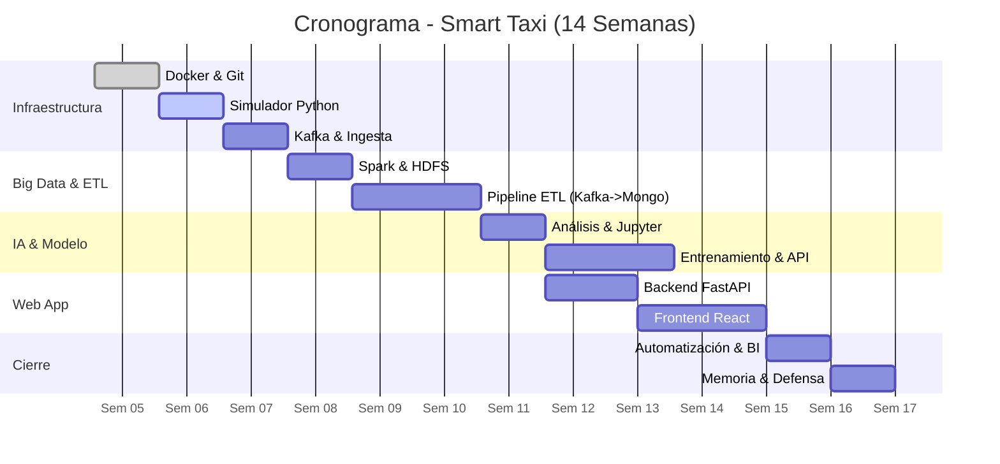

```mermaid
gantt
    title Cronograma - Smart Taxi (14 Semanas)
    dateFormat  YYYY-MM-DD
    axisFormat  Sem %W
    
    section Infraestructura
    Docker & Git                     :done,    d1, 2024-02-01, 7d
    Simulador Python                 :active,  d2, after d1, 7d
    Kafka & Ingesta                  :         d3, after d2, 7d

    section Big Data & ETL
    Spark & HDFS                     :         d4, after d3, 7d
    Pipeline ETL (Kafka->Mongo)      :         d5, after d4, 14d

    section IA & Modelo
    Análisis & Jupyter               :         d6, after d5, 7d
    Entrenamiento & API              :         d7, after d6, 14d

    section Web App
    Backend FastAPI                  :         d8, after d6, 10d
    Frontend React                   :         d9, after d8, 14d

    section Cierre
    Automatización & BI              :         d10, after d9, 7d
    Memoria & Defensa                :         d11, after d10, 7d
```
